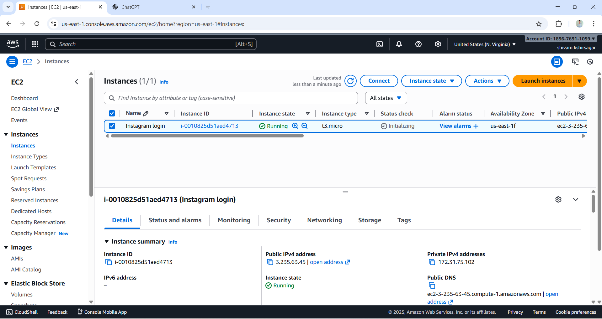
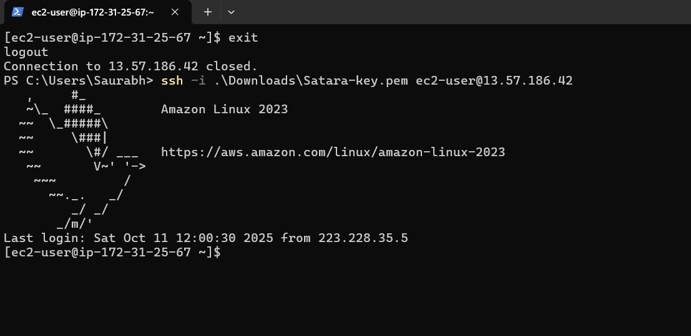

# Instagram Login Page Deployment on Amazon Linux EC2  ( Amazon Linux + NGINX + Login Page )

#  Overview

## This guide explains how to deploy a production-ready Instagram-style login page on an Amazon Linux EC2 instance. The deployment uses

* ### Amazon Linux 2023 – lightweight, secure Linux server
* ### Nginx – high-performance web server
* ### HTML/CSS – modern Instagram-inspired front-end design
* ### Systemd – ensures Nginx auto-starts on reboot
* ### AWS Security Groups – to allow HTTP/SSH access

## Project: Instagram Login Page Deployment on Amazon Linux EC2

#   Step-by-Step Deployment Guide

* # 1: Launch Amazon Linux EC2 Instance
### Theory:  We are creating a cloud server (EC2 instance) to host our login page and allow public access via browser.

* ### Go to AWS Console → EC2 → Launch Instance
* ### Select Amazon Linux 2023 AMI
* ### Choose t3.micro (Free Tier)
* ### Configure Key Pair (create new or use existing) for SSH access
* ### Configure Security Group:

    * SSH → Port 22 → Source: My IP

   * HTTP → Port 80 → Source: Anywhere
# Screenshot   

# 2: Connect to EC2 via SSH
### Theory: SSH connection allows you to remotely manage the EC2 instance from your local machine.

## Commands:
     ssh -i "Your_key" ec2-user@<your-ec2-ip>
# Screenshot   

# 3: Install and Start NGINX
### Theory: NGINX is a web server that serves our HTML/CSS login page; enabling it ensures it starts automatically on reboot.
 

## Commands:
        sudo yum update -y

        sudo yum install nginx -y

        sudo systemctl start nginx
    
        sudo systemctl enable nginx
# Screenshot   

# 4: Deploy Instagram Login Page
### Theory: We replace the default NGINX page with our custom Instagram login page so it can be accessed via browser.

## Commands: 
 
    sudo nano /usr/share/nginx/html/index.html    

    * Paste the Instagram HTML/CSS

    * Save and exit.

 # Screenshot      

# 5: Set File Permissions
### Theory: Allows Nginx to read website files

## Commands:

     * sudo chown -R nginx:nginx /usr/share/nginx/html

# 6: Restart Nginx
### Theory: Applies all changes by restarting Nginx.

## Commands:

     * sudo systemctl restart nginx

# 7: Access Website
### Theory: Access the deployed website using EC2 public IP.

      * http://EC2_PUBLIC_IP

 
 #  Deployment Success
 ### Theory: The Instagram login page is successfully displayed in the browser using the EC2 public IP address.

 
  